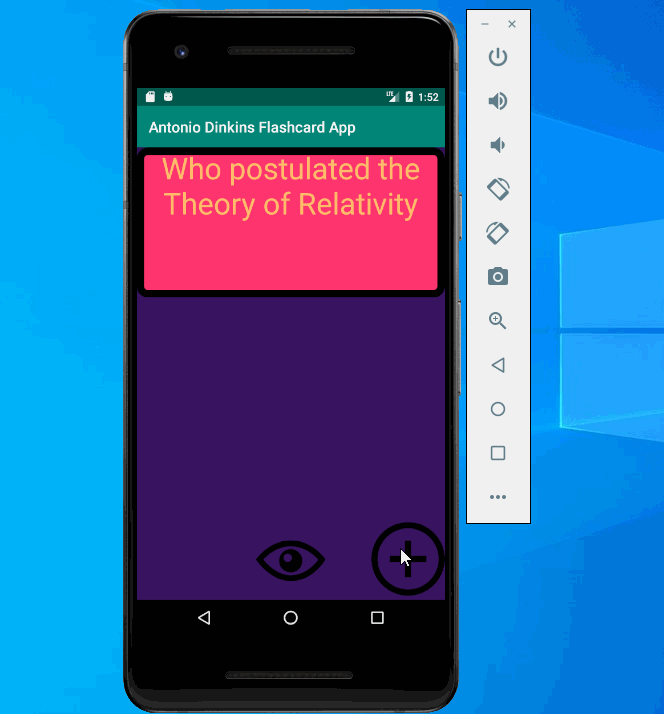

## Antonio Dinkins' Flashcard App 

📝 `NOTE:` Paste the README templates for each subsequent lab here at the top, (i.e. lab 2, 3, 4). This will show a history of your development process including which users tories you completed and how your app looked and functioned at each step.
## Lab 3

### App Description
This app version adds the ability to save data and view multiple saved flashcards

### App Walk-though
`TODO://` Add the URL to your animated app walk-though `gif` in the image tag below. Make sure the gif actually renders and animates when viewing this README. (☝️ Remove this paragraph after after adding gif)

 

`TODO://` In the User stories section below, add an `x` between the `-[ ]` like this `- [x]` for any user story you complete. (☝️ Remove this paragraph after after checking off user stories)

## Required
- [X] User can create a card and still see their created card when the app is relaunched.
- [X] User can create muliple cards and browse through all created cards

## Optional
- [X] User can delete a card and no longer see it in their deck anymore
- [ ] Flashcards are shown in random order instead of the order they were created in
- [ ] User can edit a card and see the edit saved when they browse through their deck of cards
- [ ] User can create flashcards with multiple answers and be able to browse through cards with multiple choice answers shown

## Lab 2

### App Description
An updated version of the Lab 2 version of the flashcard app has been made as of 3/26/2020. Included in the app walkthrough is an updated version of the app
This is the second iteration of the Flashcard app. In this iteration, I added a second view to update the question and answer. 

### App Walk-though
First iteration:  
 

Second iteration:  
 

## Required
- [X] User can click on a ‘+’ button that takes the user to new ‘Add Card Screen’
- [X] The 'Add Card Screen' has a cancel button to take the user back to the main screen
- [X] User can enter and submit a Question and Answer through the 'Add Card Screen'
- [X] User will see the card they just created on the main screen when they press the 'Save Button'
- [X] Push your progress to GitHub!

## Optional
- [X] User can edit a card
- [X] An error message is shown if the user doesn't enter both a Question and an Answer
- [X] A notification is shown if the card was created successfully
- [ ] User can also enter multiple choice answers when creating a card
- [ ] App is further styled and customized!

## Lab 1

### App Description
This app is designed for the user to click on the question and receive an answer

### App Walk-though
 

## Required
- [X] Create New Project in Android Studio
- [X] Add a view for the front side of the flashcard to display the question
- [X] Add a view for the back side of the flashcard to display the answer
- [X] Build in logic to show the answer side when the card is tapped
- [X] Push code to GitHu
## Optional
- [X] toggle the flashcard between the question side and the answer side
- [X] Style the question and answer side of the card to better distinguish between the two sides
- [X] Add selectable multiple choice answers beneath the card
- [X] Change the background color of the multiple choice answers when clicked to indicate whether the question waanswered correctly
- [ ] Further customize and style the card
